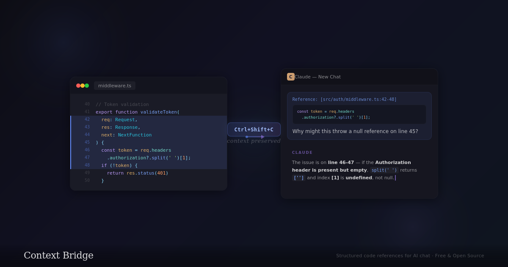

# Context Bridge



**A VS Code extension that captures developer context and formats it for LLM consumption.**

What started as a line-number capture tool has become a lightweight developer-intent bridge between your editor and AI assistants.

> Line numbers tell the LLM *what* you're looking at. But the LLM also needs to know *why* — your workflow state, recent activity, and the ambient context that shapes what kind of help you actually need.

---

## How It Works

Three layers, two capture strategies, two output formats.

```text
                ┌─────────────────────────────┐
                │      Context Assembly        │
                │    "Where am I" (polled)     │
                │  "How did I get here" (log)  │
                └──────┬──────────┬──────────┬─┘
                       │          │          │
              ┌────────┴──┐  ┌───┴─────┐  ┌─┴────────┐
              │   Event   │  │ Polled  │  │  Phase   │
              │    Log    │  │  State  │  │  Detect  │
              └───────────┘  └─────────┘  └──────────┘
               always-on      on-demand     derived
```

**Event-driven capture** runs continuously, recording high-signal developer actions into a ring buffer. **Polled state** captures the editor's ambient context only when you invoke the LLM. **Phase detection** analyzes the event log to infer what you're doing. **Context assembly** packages all three into a single bundle — compact enough for an LLM context window, rich enough to be useful.

---

## The Event-Driven Layer

A rolling activity log stored in a ring buffer (default: 200 events), capturing high-signal, low-frequency events as they happen.

| Event | Source API | Notes |
| --- | --- | --- |
| File switches | `onDidChangeActiveTextEditor` | Deduped by URI |
| File saves | `onDidSaveTextDocument` | |
| Debug session start | `onDidStartDebugSession` | Session name + type |
| Debug session end | `onDidTerminateDebugSession` | Session name + type |
| Diagnostic changes | `onDidChangeDiagnostics` | Error/warning counts |
| Terminal commands | `onDidStartTerminalShellExecution` | Full command line |
| Terminal exits | `onDidEndTerminalShellExecution` | Exit code |
| Text edits | `onDidChangeTextDocument` | Debounced 2s/file |
| Breakpoint changes | `onDidChangeBreakpoints` | +added -removed |

These events form a **narrative**. The sequence "opened A, jumped to B, searched for X, came back to A" reveals what the developer is tracing or trying to understand. The ring buffer keeps memory bounded while preserving recency.

Text edits are debounced at 2 seconds per file to avoid flooding the buffer on every keystroke. Only the fact that edits occurred is recorded, never the content — the event log captures *behavior*, not *code*.

---

## The Polled State Layer

Ambient state captured only when the LLM is actually invoked. Lazy evaluation means zero continuous overhead — the LLM call itself is the trigger.

| What's Captured | How |
| --- | --- |
| **Active editor** | Cursor, selection, visible range, dirty state, language, line count |
| **Open tabs** | All tab groups via `tabGroups` API, filtered to text documents |
| **Dirty files** | Derived from open tabs |
| **Diagnostics** | Errors and warnings only, capped at configurable max (default: 50) |
| **Breakpoints** | Source breakpoints with location, enabled state, and conditions |
| **Git status** | Branch, ahead/behind, staged, modified, untracked via `vscode.git` API |
| **Workspace folders** | All open workspace roots |

All polls run concurrently via `Promise.all()`. The git poll may need to activate the built-in Git extension on first call; everything else is synchronous. Graceful degradation: if Git isn't available, `gitStatus` is `null`.

---

## Workflow Phase Detection

The extension analyzes event log patterns to infer what the developer is doing and hints it to the LLM. A score-based system where each phase accumulates points from matching patterns — highest score wins.

| Pattern | Inferred Phase |
| --- | --- |
| Many file switches, few edits | **Exploring** |
| Edits + saves + test/build terminal commands | **Iterating** |
| Many edits, focused on few files | **Building** |
| Active debug session + breakpoint activity | **Debugging** |
| Git blame / log / diff terminal commands | **Archaeology** |

Each assessment includes:

- **Phase name** — exploring, iterating, building, debugging, archaeology
- **Confidence score** — 0.0 to 1.0, normalized
- **Reasoning** — human-readable ("Navigated across 5 files with 8 switches and minimal edits")
- **Recent files** — list of recently touched files

> A phase hint like "user appears to be debugging data flow across these 3 files" gives the LLM dramatically better response quality than raw code alone.

With fewer than 3 events in the window, phase detection returns `unknown` with zero confidence. Honest: insufficient data means no guess.

---

## Context Assembly

Press **`Ctrl+Shift+A`** and all three layers converge:

1. **Snapshot** the rolling event log (configurable window, default 60s)
2. **Poll** ambient state at that instant
3. **Detect** workflow phase from the event snapshot
4. **Capture** current code selection if any
5. **Package** everything into a `ContextBundle` (v1 schema)

The bundle ships in two formats simultaneously:

- **Clipboard** — formatted markdown (~700 tokens typical), designed for pasting into an LLM chat. Compact event descriptions with relative timestamps, diagnostics summary, tab list, git status, and phase assessment.
- **JSON** — structured data via the debug command or POSTed to a configured endpoint. Full typed schema for programmatic consumption.

### Token Budget

The formatted output is token-aware by design:

| Element | Cap |
| --- | --- |
| Error diagnostics | 10 |
| Warning diagnostics | 5 |
| Open tabs | 15 |
| Breakpoints | 10 |
| Timestamps | Relative, not absolute |

---

## Commands

| Command | Title | Access |
| --- | --- | --- |
| `ctxbridge.sendToClaudeCode` | Send to Claude Code | `Ctrl+Shift+C` / `Cmd+Shift+C`, context menu |
| `ctxbridge.sendCodeRef` | Send Code Reference | Context menu |
| `ctxbridge.assembleContext` | Assemble Developer Context | `Ctrl+Shift+A` / `Cmd+Shift+A`, context menu |
| `ctxbridge.showContextJson` | Show Context JSON | Command palette |

### `sendToClaudeCode`

Formats a code reference as markdown with clickable `file:line` links and fenced code blocks. Copies to clipboard. The quick "show the LLM this code" action.

### `sendCodeRef`

Creates structured JSON with file URI, line numbers, snippet, language, selection kind, and timestamp. Logs to the Context Bridge output channel. Optionally POSTs to a configured HTTPS endpoint.

### `assembleContext`

The full context capture. Snapshots the event log, polls ambient state, runs phase detection, packages everything, copies formatted markdown to clipboard. If an endpoint is configured, also POSTs the raw JSON bundle.

### `showContextJson`

Opens the raw context bundle as formatted JSON in a new editor tab. Useful for inspecting exactly what the extension captures and debugging the output.

---

## Code Reference Format

The `sendToClaudeCode` command produces clickable references that work in Claude Code's chat interface:

```text
Single line:     Reference: [file.ts:14](file.ts#L14)
Line range:      Reference: [file.ts:14-22](file.ts#L14-L22)
Cursor only:     Reference: [file.ts:14](file.ts#L14)
```

Each includes a fenced code block with syntax highlighting:

````markdown
Reference: [src/utils.ts:14-22](src/utils.ts#L14-L22)
```typescript
function parseConfig(raw: string) {
  ...
}
```
````

Line numbers are always **1-indexed** (human-readable). VS Code uses 0-indexed internally; the extension adds `+1` at the boundary.

---

## Context Bundle Schema

<details>
<summary><strong>Full JSON schema example</strong></summary>

```json
{
  "version": 1,
  "timestamp": "2026-02-12T15:30:00.000Z",
  "eventLog": [
    { "kind": "file_switch", "timestamp": 1739..., "fromUri": "...", "toUri": "..." },
    { "kind": "text_change", "timestamp": 1739..., "uri": "...", "changeCount": 3 },
    { "kind": "file_save",   "timestamp": 1739..., "uri": "...", "languageId": "typescript" }
  ],
  "state": {
    "activeEditor": {
      "uri": "...", "languageId": "typescript", "cursorLine": 42,
      "cursorColumn": 15, "lineCount": 200, "isDirty": true
    },
    "openTabs": [
      { "uri": "...", "label": "utils.ts", "isDirty": false }
    ],
    "dirtyFiles": [ "file:///path/to/unsaved.ts" ],
    "diagnostics": [
      { "uri": "...", "severity": "error", "message": "...", "line": 17 }
    ],
    "breakpoints": [
      { "uri": "...", "line": 42, "enabled": true }
    ],
    "gitStatus": {
      "branch": "feature/context", "ahead": 2, "behind": 0
    },
    "workspaceFolders": [ "file:///path/to/project" ]
  },
  "phase": {
    "phase": "iterating",
    "confidence": 0.8,
    "reasoning": "Making edits (3) and running tests/builds across 2 files",
    "recentFiles": [ "file:///src/extension.ts", "file:///src/eventLog.ts" ]
  },
  "selection": {
    "uri": "...", "startLine": 14, "endLine": 22,
    "snippet": "function parseConfig...", "languageId": "typescript"
  }
}
```

</details>

---

## Roadmap

What the extension captures today, and what's next.

### Shipped

| Feature | Signal Value |
| --- | --- |
| Active editor with cursor/selection position | High |
| Error/diagnostic panel contents | High |
| Terminal commands and exit codes | High |
| Recent file navigation sequence (event log) | High |
| Breakpoint placements | High |
| Open editor tabs (contextually related files) | Medium |
| Git status (branch, staged, modified, untracked) | Medium |
| Selected text (strong intent signal when present) | Medium |

### Coming Next

| Feature | Status |
| --- | --- |
| Terminal output (build errors, stack traces) | Next |
| Git diff content (not just file list) | Next |
| Debug panel state (call stack, variables, watch) | Next |

### Planned

| Feature | Notes |
| --- | --- |
| Breadcrumb bar (current symbol/class/function scope) | |
| Search history (Ctrl+Shift+F queries, symbol lookups) | Blocked — no VS Code API for Find/Replace events |
| Recently closed files | |
| Fold state (collapsed regions as noise signal) | |
| On-demand context expansion (LLM requests more) | |

---

## Design Principles

**Text over screenshots.**
Always prefer structured text that the LLM can parse accurately and cheaply over image captures. A JSON bundle is cheaper than a screenshot and far more useful.

**Lazy evaluation.**
Don't capture what you don't need, but make it cheap to capture when you do. The polled state layer does zero work until you invoke it. The event log runs always but costs almost nothing — it's just appending to a fixed-size array.

**Lean initial payload.**
Send the lightweight bundle first. ~700 tokens for a typical context snapshot. Let the LLM request more context if the problem requires it.

**Events for narrative, polls for state.**
Events tell the story of what you've been doing — the sequence that reveals intent. Polls tell the LLM what the world looks like right now — the snapshot that grounds the response.

**Token-aware.**
Everything is structured with LLM context windows in mind. Compact event descriptions. Capped lists. Relative timestamps. No wasted tokens on irrelevant editor chrome.

**Graceful degradation.**
No Git? `gitStatus` is `null`. No shell integration? Terminal events don't fire. No debug session? Phase detection still works from file switches and edits. The extension never crashes on missing context — it just has less to say.

**Honest confidence.**
Phase detection reports a confidence score. With fewer than 3 events it returns `unknown` at 0% rather than guessing. The LLM can decide how much weight to give the assessment.

---

## Architecture

The extension is modular. Each concern has its own file with clear boundaries.

```text
src/
  extension.ts          Entry point — wires modules, registers commands
  types.ts              Shared type definitions (discriminated union for events)
  ringBuffer.ts         Generic circular buffer (pre-allocated, zero alloc after init)
  eventLog.ts           Event-driven capture (7 VS Code listeners, dedup, debounce)
  polledState.ts        On-demand state capture (5 parallel polls)
  phaseDetection.ts     Pure function, score-based pattern matching
  contextAssembly.ts    Orchestrator + LLM markdown formatter
  httpClient.ts         HTTPS POST helper
  test/
    ringBuffer.test.ts    Unit tests for RingBuffer
    phaseDetection.test.ts Unit tests for phase detection
    formatBundle.test.ts  Unit tests for context formatting
    runTest.ts            Integration test runner
    suite/                Integration test suite
```

Modules without VS Code dependencies (`types.ts`, `ringBuffer.ts`, `phaseDetection.ts`) are testable in complete isolation.

---

## Configuration

All settings are under **VS Code Settings > Context Bridge**.

| Setting | Type | Default | Description |
| --- | --- | --- | --- |
| `ctxbridge.endpoint` | `string` | `""` | HTTPS endpoint for payload delivery |
| `ctxbridge.eventBufferSize` | `number` | `200` | Max events in ring buffer (50–1000) |
| `ctxbridge.eventWindowSeconds` | `number` | `60` | Seconds of history in bundles (10–300) |
| `ctxbridge.maxDiagnosticsInContext` | `number` | `50` | Max diagnostic entries in context (10–200) |

---

## Installation

**From source:**

```bash
npm install
npm run compile
```

Then either:

- Press **F5** in VS Code to launch a debug Extension Development Host
- Or package for distribution:

  ```bash
  vsce package --no-dependencies
  # Install .vsix via Extensions > Install from VSIX
  ```

---

## Requirements

- **VS Code 1.93.0+** — required for terminal shell integration API
- **Node.js** — for building from source
- **TypeScript 5.9+** — installed as devDependency

---

## File Structure

```text
src/
  extension.ts            Entry point, command registration (~135 lines)
  types.ts                Shared type definitions (~180 lines)
  ringBuffer.ts           Generic circular buffer (~42 lines)
  eventLog.ts             Event-driven capture layer (~170 lines)
  polledState.ts          Polled state capture (~140 lines)
  phaseDetection.ts       Workflow phase detection (~135 lines)
  contextAssembly.ts      Context assembly + LLM formatter (~155 lines)
  httpClient.ts           HTTPS POST helper (~35 lines)
  test/
    ringBuffer.test.ts    Unit tests — RingBuffer (11 tests)
    phaseDetection.test.ts Unit tests — phase detection (14 tests)
    formatBundle.test.ts  Unit tests — context formatting
    runTest.ts            Integration test runner
    suite/                Integration test suite
out/                      Compiled JavaScript output
package.json              Extension manifest
tsconfig.json             TypeScript config (ES2018, strict)
CLAUDE.md                 Claude Code development guidance
README.md                 This file
```
